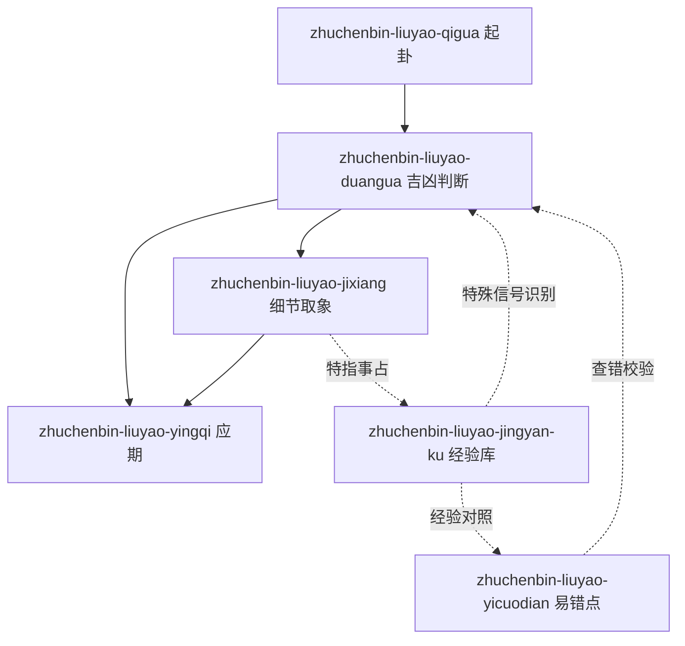

# INDEX — 朱辰彬古筮六爻 skills 总览

> 蒸馏自朱辰彬 8 部著作/资料（2026-08-08），共 6 个可复用 skills。
> 术语共享词典见 [GLOSSARY.md](./GLOSSARY.md)，案例素材见 [candidates/](./candidates/)。

## Skill 清单

| Skill | 作用 | 触发场景 |
|---|---|---|
| [zhuchenbin-liuyao-qigua](./zhuchenbin-liuyao-qigua/SKILL.md) | 摇钱起卦、排卦装卦 | 起卦问卜、装卦、错卦判断 |
| [zhuchenbin-liuyao-duangua](./zhuchenbin-liuyao-duangua/SKILL.md) | 吉凶判断核心框架（七步流程/世用关系/动爻辨析） | 断卦吉凶、成否判断 |
| [zhuchenbin-liuyao-yingqi](./zhuchenbin-liuyao-yingqi/SKILL.md) | 应期推断（20 公式 + 5 原则 + 变速器） | 何时应验、应期卦 |
| [zhuchenbin-liuyao-jixiang](./zhuchenbin-liuyao-jixiang/SKILL.md) | 卦象细节取象（卦意 12 法/读心/对轨/双核） | 细节、取象、特指事占 |
| [zhuchenbin-liuyao-jingyan-ku](./zhuchenbin-liuyao-jingyan-ku/SKILL.md) | 特殊案例经验库（占此应彼/错卦正显/金融卦） | 卦不对题、没测准、金融博弈 |
| [zhuchenbin-liuyao-yicuodian](./zhuchenbin-liuyao-yicuodian/SKILL.md) | 易错点清单（35 条，含卦评归纳） | 断前自查、断后回溯 |

## 引用关系图

## 典型组合流程

1. **完整断一卦**：qigua（起卦装卦）→ duangua（辨卦种→取用→旺衰→动爻→世用定性→对轨）→ yingqi（推应期）→ jixiang（细节/读心）
2. **卦不对题/测不准**：jingyan-ku（识别占此应彼/心态卦）→ yicuodian（回溯是否踩误区）→ duangua（重断）
3. **金融投资类**：jingyan-ku（自然卦/心态波动/三板斧）→ duangua（取用+吉凶）→ yingqi（应期）

## 验证状态

- 三重验证：全部 skill 通过 V1（多书互证）/ V2（可回答新问题）/ V3（非常识）
- 压力测试：见各 skill 的 test-prompts.json（阶段 4）
- 审计轨迹：candidates/（提取素材）、rejected/（淘汰单元）
